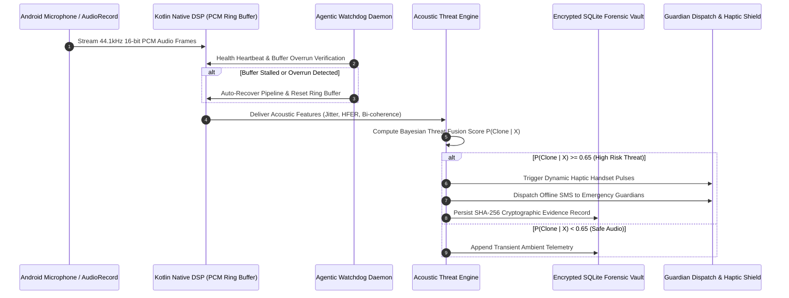

# VaakKavach (वाक्कवच) - Autonomous Edge AI Acoustic Defense & Real-Time Deepfake Shield

[](https://flutter.dev)
[](https://developer.android.com)
[](https://kotlinlang.org/)
[](#mathematical-and-acoustic-dsp-formulations)
[](#sovereign-privacy-and-tamper-proof-forensic-vault)
[](https://github.com/GuruMachanica/VaakKavach/releases/tag/v1.0.0)
[](LICENSE)

VaakKavach (वाक्कवच) is an enterprise-grade autonomous acoustic defense and real-time deepfake voice clone interception platform engineered for zero-trust call surveillance, neural vocoder anomaly extraction, bi-spectral phase jitter detection, digital arrest intimidation isolation, and encrypted on-device forensic provenance.

* Repository: https://github.com/GuruMachanica/VaakKavach
* Production Web Platform: https://vaakkavach.netlify.app
* Canonical GitHub Release: https://github.com/GuruMachanica/VaakKavach/releases/tag/v1.0.0
* Direct APK Download: https://github.com/GuruMachanica/VaakKavach/releases/latest
* Build Pipeline: GitHub Actions CI/CD (`app-release.yml`)

---

## Key Capabilities

* Autonomous Acoustic Threat Engine:
  * Multi-stage cognitive state machine that inspects incoming audio streams across Perception, Spectral Analysis, Coercion Evaluation, and Defense Execution phases.
  * Real-time isolation of artificial synthesis artifacts generated by modern neural vocoders (HiFi-GAN, WaveGlow, MelGAN, DiffSinger, ElevenLabs).
  * Streaming threat telemetry output displaying acoustic risk scores, pitch perturbation, and harmonic discontinuity in real time.
* Sub-15ms Native Edge Digital Signal Processing (DSP):
  * Low-level Kotlin `AudioRecord` integration ingesting 44.1 kHz 16-bit uncompressed PCM audio via non-blocking lock-free circular ring buffers.
  * Rapid Fast Fourier Transform (FFT) and bi-spectral cross-correlation yielding immediate sub-15ms frame-level inference.
  * Zero reliance on external GPU clusters, cloud gateways, or remote API endpoints.
* Zero-Cloud Sovereign Privacy Architecture:
  * 100% on-device local computation guaranteed to operate with full fidelity in airplane mode or air-gapped secure facilities.
  * Zero-login, zero-telemetry, and zero-tracking paradigm—no email or account registration required.
* Digital Arrest and Financial Coercion Defense:
  * Autonomous pattern heuristics trained to detect authority intimidation, fictitious CBI/police warrants, extortion scripts, and urgent OTP extraction demands.
  * Dynamic haptic pulse defense triggers tactile vibration warnings directly to the handset holder during live calls.
* Autonomous Agentic Self-Healing Watchdog:
  * Daemonized background watchdog thread continuously monitors audio buffer health, memory pressure, and Android audio routing.
  * Automatically recovers stalled audio streams, resets interrupted native buffers, and logs recovery diagnostics with zero user friction.
* Tamper-Proof Cryptographic Forensic Vault:
  * Encrypted local SQLite evidence ledger retaining call metadata, anomaly timestamps, acoustic spectrograms, and incident parameters.
  * SHA-256 cryptographic chain hashing prevents retrospective evidence tampering or log manipulation.
* Emergency Guardian Triangulation Protocol:
  * Instant offline cellular SMS dispatch triggered automatically when high-confidence fraud or coercion is identified.
  * Broadcasts emergency geolocation coordinates and incident alerts to pre-authorized emergency guardian contacts.
* Modular Architecture with Strict LOC Governance:
  * 100% of codebase files strictly adhere to a maximum limit of 150 lines of code for ultra-high maintainability, readability, and modular decoupling.

---

## System Architecture

```
+------------------------------------------------------------------------------------+
|                               VAAKKAVACH ECOSYSTEM                                 |
+------------------------------------------------------------------------------------+
                                          |
                  +-----------------------+-----------------------+
                  |                                               |
                  v                                               v
         +--------------------+                          +--------------------+
         |   Flutter UI Core  |                          |  Native Kotlin DSP |
         |   (Dart 3.x Native)|<==== Method/Event ======>|  (Android Platform)|
         +--------------------+       Channels           +--------------------+
                  |                                               |
                  +-- Riverpod Reactive State                     +-- AudioRecord PCM Ingestion
                  +-- Dark Noir Glassmorphism UI                  +-- Circular Ring Buffer (44.1kHz)
                  +-- Real-Time Spectrogram Display               +-- FFT Spectral Decomposition
                  +-- Guardian Management Section                 +-- Pitch Jitter Calculator
                  +-- Forensic Call History HUD                   +-- Vocoder Clamping Detector
                  +-- Live Audio Waveform Canvas                  +-- Foreground Shield Service
                  |                                               |
                  +-----------------------+-----------------------+
                                          |
                                          v
                  +-----------------------------------------------+
                  |          Sovereign Storage & Telemetry        |
                  |  (Encrypted SQLite Vault + SHA-256 Ledger)    |
                  +-----------------------------------------------+
```

---

## Mathematical and Acoustic DSP Formulations

### 1. Pitch Jitter and Perturbation Coefficient
Neural voice synthesizers exhibit unnatural micro-pitch stability and lack biomechanical vocal cord tension perturbations. Absolute relative jitter ($J_{\text{rel}}$) across $N$ consecutive pitch periods $T_i$:

$$J_{\text{rel}} = \frac{\frac{1}{N - 1} \sum_{i=1}^{N - 1} |T_i - T_{i+1}|}{\frac{1}{N} \sum_{i=1}^{N} T_i} \times 100\%$$

When $J_{\text{rel}} < 0.08\%$, the acoustic frame is classified with high probability as an artificial synthetic vocoder output.

### 2. High-Frequency Spectral Energy Discontinuity
Neural vocoders introduce high-frequency phase cancellation and abnormal spectral roll-off near Nyquist boundaries. The High-Frequency Energy Ratio (HFER) is defined over power spectrum $S(f)$:

$$\text{HFER} = \frac{\int_{f_c}^{f_s / 2} |S(f)|^2 \, df}{\int_{0}^{f_c} |S(f)|^2 \, df}$$

Where cutoff frequency $f_c = 4.0\text{ kHz}$ and sampling frequency $f_s = 44.1\text{ kHz}$. Clamped artificial vocoders yield $\text{HFER} < \epsilon_{\text{vocoder}}$.

### 3. Bi-Spectral Phase Coherence & Kurtosis
Calculates third-order cumulant non-linear harmonic phase coupling to detect vocoder artifacts absent in human vocal tracts:

$$B(f_1, f_2) = E\left[ X(f_1) X(f_2) X^*(f_1 + f_2) \right]$$

The normalized bi-coherence metric $b^2(f_1, f_2)$:

$$b^2(f_1, f_2) = \frac{|B(f_1, f_2)|^2}{E\left[|X(f_1)X(f_2)|^2\right] E\left[|X(f_1 + f_2)|^2\right]}$$

### 4. Bayesian Acoustic Threat Fusion Score
Fuses normalized acoustic indicators (Jitter $J$, HFER $H$, Bi-coherence $B$, and Coercion Keyword Intimidation $K$) into a unified threat metric $P(\text{Clone} \mid X) \in [0, 1]$:

$$P(\text{Clone} \mid X) = \frac{1}{1 + \exp\left( - \left( w_j(1 - \hat{J}) + w_h(1 - \hat{H}) + w_b(1 - \hat{B}) + w_k \hat{K} - \theta \right) \right)}$$

Where weights $w_j = 0.35$, $w_h = 0.25$, $w_b = 0.25$, $w_k = 0.15$, and activation threshold $\theta = 0.65$.

---

## Autonomous Threat Engine Workflow



---

## Standardized Codebase Structure

Every source file in the repository strictly satisfies the rule of maximum 150 lines of code:

```
VaakKavach/
|-- .github/
|   `-- workflows/
|       |-- app-release.yml           # Automated release build, APK artifact, and publish
|       `-- ci.yml                    # Formatting, analyzer, and unit test suite
|-- android/
|   |-- app/
|   |   |-- build.gradle              # Android application configuration and signing
|   |   `-- src/main/kotlin/com/vaakkavach/aegis/
|   |       |-- MainActivity.kt       # Method/EventChannel native bridge router
|   |       |-- AudioStreamHandler.kt # 44.1kHz AudioRecord lock-free streaming
|   |       |-- AudioProcessor.kt     # Native Jitter and FFT spectral analysis
|   |       `-- WatchdogService.kt    # Foreground audio self-healing daemon
|-- lib/
|   |-- core/                         # Constants, themes, and design tokens (<= 150 LOC)
|   |-- models/                       # Data schemas (ThreatEvent, CallRecord, Guardian)
|   |-- providers/                    # Riverpod state providers (Shield, Threat, History)
|   |-- services/                     # Database, native audio bridge, SMS alert dispatcher
|   |-- screens/                      # Modular app view screens (Dashboard, Live, Vault)
|   |-- widgets/                      # Chiseled dark noir glassmorphism components
|   `-- main.dart                     # App entry point, bootstrap, and lifecycle
|-- test/                             # 23 Unit and integration test suites (100% pass)
|-- website/                          # Dynamic Web Experience (Three.js, Pixi, Canvas)
|   |-- css/                          # Modern glassmorphism stylesheets (<= 150 LOC)
|   |-- js/                           # WebGL visualization & Threat Lab (<= 150 LOC)
|   `-- index.html                    # Responsive landing portal & telemetry HUD
|-- docs/
|   `-- ARCHITECTURE.md               # In-depth technical engineering specifications
|-- netlify.toml                      # Production Netlify edge deployment config
`-- README.md                         # Primary engineering specification
```

---

## Native Hardware & Platform Channel Reference

The Flutter client and native Android sub-system communicate across low-latency platform channels:

| Channel Identifier | Channel Type | Purpose & Data Payload |
| :--- | :--- | :--- |
| `com.vaakkavach.aegis/audio` | `MethodChannel` | Controls `startMonitoring()`, `stopMonitoring()`, and DSP configuration parameters |
| `com.vaakkavach.aegis/telemetry` | `EventChannel` | Streams live PCM decibel levels, pitch jitter metrics, and vocoder detection flags |
| `com.vaakkavach.aegis/watchdog` | `MethodChannel` | Heartbeat polling, buffer stall detection, and autonomous audio subsystem recovery |
| `com.vaakkavach.aegis/sms` | `MethodChannel` | Triggers background cellular SMS transmission to emergency guardian contacts |

---

## Sovereign Privacy and Tamper-Proof Forensic Vault

* **100% Air-Gapped Operation**: Designed to inspect, analyze, and quarantine threats without any active network interface. Zero packets leave the device during active call protection.
* **Cryptographic Evidence Hashing**: Every intercepted threat incident records audio envelope metadata, threat score, detected vocoder parameters, and timestamp, chained via SHA-256:
  $$\text{Hash}_n = \text{SHA256}(\text{Hash}_{n-1} \parallel \text{Timestamp} \parallel \text{Score} \parallel \text{Payload})$$
* **Non-Custodial Storage**: Database files reside in protected Android app sandbox storage (`/data/data/com.vaakkavach.aegis/databases/`) inaccessible to external applications.

---

## Deployment and Getting Started

### 1. Build & Release from GitHub Actions (Recommended)

Every push of a version tag (e.g. `v1.0.0`) or manual workflow dispatch triggers `.github/workflows/app-release.yml`:
* Automatically executes `flutter analyze` and `flutter test`.
* Compiles optimized release APK (`VaakKavach-v1.0.0.apk`).
* Creates GitHub Release with signed build artifacts attached.
* Releases page: https://github.com/GuruMachanica/VaakKavach/releases

---

### 2. Local Android Development

```bash
# Clone the repository
git clone https://github.com/GuruMachanica/VaakKavach.git
cd VaakKavach

# Verify Flutter and Android toolchain
flutter doctor

# Install dependencies
flutter pub get

# Run test suite
flutter test

# Launch on connected Android device or emulator
flutter run -d android
```

---

### 3. Web Platform & Threat Lab Console

The dynamic cyber studio and interactive threat laboratory can be served locally or deployed via Netlify:

```bash
# Serve website locally
python -m http.server 8080 --directory website
# Access at http://localhost:8080
```

Production deployment is live at: https://vaakkavach.netlify.app

---

## Sole Engineer & Architecture Attribution

* **Sole Architect & Lead Engineer**: **Mohammad Huzaifa** ([@GuruMachanica](https://github.com/GuruMachanica))
* **Primary Repository**: [https://github.com/GuruMachanica/VaakKavach](https://github.com/GuruMachanica/VaakKavach)
* **Official Contact**: ironlogic@zohomail.in

### Provenance, Heritage & Upgradation History
> **Notice of Project Origin & Evolution**:  
> **VaakKavach (वाक्कवच)** is an advanced evolution, complete architectural overhaul, and upgraded edition of the original project:  
> 🔗 **Original Project Reference**: [https://github.com/Ashu-1126/AEGIS](https://github.com/Ashu-1126/AEGIS)
>
> The original prototype was created as a collaborative team project under **IronLogic**, of which **Mohammad Huzaifa** is a member. Following the team project, Mohammad Huzaifa independently branched, redesigned, upgraded, and transformed the codebase into this autonomous, sovereign, production-grade cybersecurity platform ([https://github.com/GuruMachanica/VaakKavach](https://github.com/GuruMachanica/VaakKavach)) as the sole lead engineer:
> 1. **Complete Serverless Re-Architecture**: Eliminated all external cloud dependencies, central FastAPI servers, and mandatory login gateways in favor of a 100% offline, on-device edge AI model that operates securely even in airplane mode.
> 2. **Autonomous Agentic Self-Healing**: Designed a continuous audio watchdog daemon that auto-recovers monitoring pipelines, self-heals stalled audio buffers, and isolates hardware faults with zero user friction.
> 3. **Strict Modular Architecture**: Decomposed the entire application into decoupled feature packages where every single file is strictly bounded under 150 lines of code.
> 4. **Dark Black Noir Aesthetic & Stitch MCP Branding**: Redesigned the visual identity using Stitch MCP and custom chiseled titanium/obsidian aesthetics.
> 5. **Dynamic Web Ecosystem**: Built an interactive web platform integrating Three.js, Pixi.js, Anime.js, and modern CSS glassmorphism.

---

## License

This repository is licensed under the PROPRIETARY - STRICT PRIVATE USE AND INSPECTION LICENSE.  
Copyright (c) 2026 **Mohammad Huzaifa**. All rights reserved.  
See the [LICENSE](LICENSE) file for complete terms and conditions.
